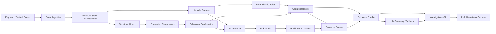

<div align="center">

# 🛡️ Refund Sentinel

### AI Risk Manager for Coordinated Refund Abuse

**Razorpay AI Buildathon 2026 · Track 02 — AI Risk Manager**

[](LICENSE)
[](https://www.python.org/)
[](https://fastapi.tiangolo.com/)
[](https://react.dev/)
[](https://www.typescriptlang.org/)
[](https://vite.dev/)
[](https://www.postgresql.org/)
[](#-machine-learning)

</div>

---

## Table of Contents

- [What is Refund Sentinel?](#what-is-refund-sentinel)
- [Why this matters](#why-this-matters)
- [Core thesis](#core-thesis)
- [What makes it different](#what-makes-it-different)
- [Product flow](#product-flow)
- [Architecture](#architecture)
- [Tech stack](#tech-stack)
- [Machine learning](#machine-learning)
- [Financial exposure model](#financial-exposure-model)
- [Evaluation](#evaluation)
- [Demo scenarios](#demo-scenarios)
- [LLM safety boundary](#llm-safety-boundary)
- [Repository structure](#repository-structure)
- [Quick start](#quick-start)
- [Running the benchmark](#running-the-benchmark)
- [Running the demo](#running-the-demo)
- [Razorpay Test Mode](#razorpay-test-mode)
- [Quality and reproducibility](#quality-and-reproducibility)
- [Security](#security)
- [Known limitations](#known-limitations)
- [Documentation](#documentation)
- [Hackathon positioning](#hackathon-positioning)

---

## What is Refund Sentinel?

Refund Sentinel is a **refund-lifecycle-aware coordinated refund-abuse detection and investigation system**.

The problem is simple but easy to miss: one refund can look legitimate while a set of apparently independent refunds reveals a coordinated pattern.

```text
Individual transaction
        ↓
Looks plausible

Cross-account analysis
        ↓
Shared relationships
+ lifecycle similarity
+ temporal concentration
+ behavioral consistency
        ↓
Coordinated pattern
        ↓
Risk + evidence + financial exposure
        ↓
Investigation priority
```

The system is designed for merchant risk investigators, not for making irreversible automated accusations.

> **Risk is a signal. Evidence is the explanation. Financial exposure is the operational context.**

---

## Why this matters

A conventional refund-risk workflow often thinks in one transaction at a time:

```text
Refund request → customer score → approve / reject
```

Refund Sentinel changes the unit of analysis:

```text
Payment
  ↓
Order / delivery lifecycle
  ↓
Refund lifecycle
  ↓
Customer behavior
  ↓
Cross-account relationships
  ↓
Temporal coordination
  ↓
Financial exposure
  ↓
Investigation priority
```

This matters because coordinated behavior can be a property of a **network and sequence**, not just an individual transaction.

---

## Core thesis

> **Individual refunds can appear legitimate in isolation. Coordinated refund abuse becomes detectable when refund-lifecycle timing, behavioral patterns across accounts, structural relationships, and aggregate financial impact are analyzed together — while legitimate shared-identity scenarios are explicitly modeled as negative controls.**

This thesis drives both the architecture and the evaluation methodology.

The project intentionally avoids the shortcut of treating a shared address or device as proof of abuse. A structural connection is only one input; behavioral confirmation is required before cluster evidence materially contributes to the final risk score.

---

## What makes it different

### 1. Refund-lifecycle awareness

The system does not treat the refund as an isolated row. It reconstructs the payment → order → delivery → refund sequence and derives features such as:

- capture-to-refund-request latency;
- order-to-refund latency;
- delivery-to-refund latency;
- refund amount fraction;
- full-vs-partial refund state;
- historical refund rate and velocity.

### 2. Structure + behavior, not graph magic

The structural graph answers:

> **Who is connected?**

The behavioral layer asks:

> **Are those connected accounts actually behaving in a coordinated way?**

```text
Shared address / device
        ↓
Structural cluster
        ↓
Lifecycle alignment
+ temporal burst
+ reason similarity
+ active-refund concentration
        ↓
Behavioral confirmation
        ↓
Cluster features allowed to contribute
```

That is the project's main defense against graph-driven false positives.

### 3. Financial impact is separated from model risk

The system keeps three concepts distinct:

| Measure | Meaning |
|---|---|
| **Realized suspicious refund amount** | Already processed refund amount weighted by risk; retrospective context only |
| **Pending refund exposure** | Requested but not processed amount weighted by risk; potentially actionable |
| **Remaining refundable exposure** | Additional refundable amount still available under current policy; forward-looking estimate |

The UI never labels already-processed money as automatically recoverable.

### 4. The LLM is outside the authoritative decision path

The LLM receives a structured evidence bundle and creates a human-readable investigation narrative.

It **cannot**:

- determine financial state;
- approve or reject a refund;
- override the risk engine;
- invent evidence;
- execute financial APIs.

If the external provider is unavailable, the structured evidence bundle remains available and the system falls back to a deterministic narrative.

### 5. Evaluation is comparative and falsifiable

Refund Sentinel is evaluated against three conceptually different baselines:

```text
Baseline A
Individual behavior only

Baseline B
Structural graph only

Baseline C
Full multi-signal system
```

The benchmark is designed to expose both failure modes: individual-only misses coordination; structural-only can overreact to legitimate shared infrastructure.

---

## Product flow



---

## Architecture

### Runtime layers

| Layer | Purpose |
|---|---|
| Domain | Typed events, entities, identifiers, enums, value objects |
| Persistence | Append-only event ledger and ingestion records |
| Finance | Deterministic financial-state reconstruction and exposure |
| Graph | Structural entity relationships and connected components |
| Risk | Features, deterministic rules, behavioral confirmation, score |
| ML | Dataset preparation, preprocessing, logistic model, inference, evaluation |
| Simulator | Reproducible abuse and legitimate benchmark scenarios |
| Investigator | Evidence bundle and LLM/fallback narrative |
| API | FastAPI routes for queue, cases, evaluation and webhooks |
| Frontend | React/TypeScript investigation and evaluation console |

### Data flow

```text
Raw event
   ↓
Validation / normalization
   ↓
Event ledger
   ↓
Point-in-time financial reconstruction
   ↓
┌────────────────────────────────────┐
│                                    │
│  lifecycle + behavior              │  structural relationships
│                                    │
└───────────────┬────────────────────┘
                ↓
       behavioral confirmation
                ↓
        risk / priority layer
                ↓
        exposure + evidence
                ↓
        investigator interface
```

For the deeper system design, see [`docs/ARCHITECTURE.md`](docs/ARCHITECTURE.md).

---

## Tech stack

### Backend

| Technology | Role | Current project version |
|---|---|---|
| **Python** | Runtime | 3.11+ |
| **FastAPI** | HTTP API | 0.115.x |
| **Uvicorn** | ASGI server | 0.30.x |
| **Pydantic** | Domain/API validation | 2.10.x |
| **pydantic-settings** | Configuration | 2.6.x |
| **SQLAlchemy** | Persistence ORM | 2.0.x |
| **psycopg3** | PostgreSQL driver | 3.2.x |
| **Alembic** | Database migration tooling | 1.13.x |
| **pytest / pytest-asyncio** | Test suite | 8.2.x / 0.23.x |

### Frontend

| Technology | Role | Current project version |
|---|---|---|
| **React** | UI | 19.x |
| **React DOM** | Browser runtime | 19.x |
| **TypeScript** | Type-safe frontend code | 6.x |
| **Vite** | Dev server / build | 8.x |
| **ESLint** | Static analysis | 10.x |

### Data and infrastructure

| Technology | Role |
|---|---|
| **PostgreSQL 16** | Persistent event/state store |
| **Docker / Docker Compose** | Reproducible backend + database environment |
| **JSON / JSONL** | Model artifacts, evaluation output, synthetic datasets |

### Graph and ML

The current implementation deliberately avoids an external graph library dependency. Structural graphs and connected components are implemented with typed domain structures and deterministic adjacency/DFS traversal.

The deployed model is a **custom binary logistic regression implementation** with explicit preprocessing and persisted coefficients. The project does not ship a LightGBM or XGBoost runtime dependency.

### LLM

The investigator layer currently supports provider-aware HTTP calls for **Gemini** and **OpenAI-compatible configuration**, with a deterministic fallback path. The default project configuration uses:

```text
Provider: Gemini
Model: gemini-2.5-flash
```

The LLM is a narrative layer, not the financial or risk authority.

---

## Machine learning

The deployed analytical model is intentionally simple and auditable.

### Model

```text
Binary Logistic Regression
        ↓
probability in [0, 1]
        ↓
additional analytical signal
```

The current artifact is stored at:

```text
backend/app/models/risk_model.json
```

### Feature strategy

The current runtime exposes **46 model inputs** after categorical expansion / preprocessing. The underlying features are organized around:

- refund lifecycle;
- individual customer behavior;
- cluster-level behavioral coordination;
- relationship context;
- explicit null/missingness handling.

Financial exposure values are intentionally kept out of the risk model and applied after scoring.

### Model boundary

The ML output is not treated as ground truth. The operational score combines model output with deterministic evidence and policy-controlled signals.

---

## Financial exposure model

Refund Sentinel deliberately separates risk estimation from money accounting.

### A. Realized suspicious amount

```text
sum(processed_refund_amount) × risk score
```

Interpretation: retrospective suspicious financial context.

### B. Pending refund exposure

```text
sum(requested_but_unprocessed_refund_amount) × risk score
```

Interpretation: potentially actionable exposure.

### C. Remaining refundable exposure

```text
sum(remaining_refundable_amount) × risk score
```

Interpretation: forward-looking exposure estimate, not a forecast of future fraud.

The primary operational prioritization concept is **top-K pending exposure capture**, although the currently persisted benchmark records the classifier's captured abuse exposure rather than a full queue-capacity curve.

---

## Evaluation

### Current held-out benchmark

The current persisted results in [`data/results.json`](data/results.json) are:

| Model | Precision | Recall | F1 | FP | FN | Abuse exposure captured |
|---|---:|---:|---:|---:|---:|---:|
| Individual-only | 100.00% | 87.18% | 93.15% | 0 | 5 | ₹9,680.37 |
| Graph structural-only | 80.95% | 43.59% | 56.67% | **4** | **22** | ₹3,117.95 |
| **Full multi-signal** | **100.00%** | **97.44%** | **98.70%** | **0** | **1** | **₹10,256.54** |

### Financial result

```text
Held-out abuse exposure      ₹10,378.11
Full-system captured         ₹10,256.54
Exposure capture rate           98.83%
```

This is an **offline benchmark measurement**, not a claim that ₹10,256.54 was literally prevented or recovered.

### Legitimate-lookalike test

The shared-household control produces:

```text
Graph-only FPR: 66.67%
Full-system FPR: 0.00%
```

That is an important demonstration of the behavioral confirmation architecture.

### Evaluation protocol

- validation data is used for threshold selection;
- held-out test labels are not used for threshold selection;
- train/validation/test partitions are customer-disjoint;
- point-in-time feature construction is enabled;
- legitimate lookalikes appear in the held-out evaluation;
- results are persisted only after evaluation.

For the exact methodology and metric caveats, see [`docs/EVALUATION.md`](docs/EVALUATION.md).

---

## Demo scenarios

The demo dataset is designed to make the system's reasoning visible rather than merely impressive.

### 1. Coordinated abuse cluster

Multiple accounts share structural relationships and exhibit tightly aligned refund behavior.

Expected result:

```text
behavioral confirmation → PASS
cluster evidence         → contributes
priority                 → HIGH
```

### 2. Legitimate family cluster

Family members share household infrastructure but refund at different lifecycle stages and for varied legitimate reasons.

Expected result:

```text
structural cluster       → YES
behavioral confirmation  → FAIL / LOW
cluster amplification    → suppressed
priority                 → LOW
```

### 3. Product defect spike

Many independent customers refund the same product without forming a structural customer cluster.

Expected result:

```text
product-wide signal      → visible
customer clustering      → absent
cluster amplification    → none
```

### 4. High-value moderate-risk case

A single account has a large pending refund but only moderate behavioral risk.

Expected result:

```text
moderate risk + high pending exposure
→ high investigation priority
```

### 5. Low-value coordinated cases

Strong coordination but small individual refunds.

Expected result:

```text
high risk does not automatically mean highest priority
```

This demonstrates the difference between **risk-only ranking** and **risk + financial context**.

---

## LLM safety boundary

The LLM receives an evidence bundle containing structured facts such as:

- refund and payment identifiers;
- lifecycle timestamps;
- behavioral feature values;
- structural cluster evidence;
- mitigating evidence;
- financial context;
- model/rule outputs.

It generates only:

```text
headline
narrative summary
key risk drivers
suggested action rationale
```

The deterministic evidence remains visible alongside the generated text.

### Failure behavior

```text
Gemini available
      ↓
LLM-generated investigator summary

Gemini unavailable / rate limited / malformed
      ↓
heuristic deterministic narrative
      ↓
structured evidence remains available
```

No LLM failure should invalidate financial correctness.

---

## Repository structure

```text
Refund-Sentinel/
├── backend/
│   ├── __init__.py
│   ├── app/
│   │   ├── api/
│   │   ├── domain/
│   │   ├── finance/
│   │   ├── graph/
│   │   ├── investigator/
│   │   ├── ml/
│   │   ├── persistence/
│   │   ├── risk/
│   │   ├── simulator/
│   │   ├── config.py
│   │   ├── main.py
│   │   └── models/risk_model.json
│   ├── tests/
│   ├── .env.example
│   └── requirements.txt
├── data/
│   ├── train.jsonl
│   ├── eval.jsonl
│   ├── test_heldout.jsonl
│   └── results.json
├── frontend/
│   ├── src/
│   ├── package.json
│   └── package-lock.json
├── scripts/
│   ├── generate_datasets.py
│   ├── run_evaluation.py
│   ├── seed_demo.py
│   └── train_model.py
├── docs/
│   ├── ARCHITECTURE.md
│   ├── EVALUATION.md
│   ├── LIMITATIONS.md
│   └── DECISIONS.md
├── Dockerfile
├── docker-compose.yml
├── pytest.ini
└── README.md
```

---

## Quick start

### 1. Create and activate the Python environment

```powershell
python -m venv .venv
.\.venv\Scripts\Activate.ps1
```

### 2. Install backend dependencies

```powershell
pip install -r backend\requirements.txt
```

### 3. Configure environment variables

```powershell
Copy-Item backend\.env.example backend\.env
```

Set at least the local database URL and an application API key as appropriate for your environment.

For local SQLite development, the application has a safe default. For PostgreSQL-backed development, use the Docker Compose service described below.

### 4. Start PostgreSQL (optional but recommended for the full integration path)

```powershell
docker compose up -d db
```

The Compose database is exposed on host port `5433`.

### 5. Run tests

```powershell
pytest -q
```

### 6. Start the API

```powershell
python -m uvicorn backend.app.main:app --reload
```

The API is available at:

```text
http://127.0.0.1:8000
```

### 7. Start the frontend

In a second terminal:

```powershell
cd frontend
npm ci
npm run dev
```

---

## Running the benchmark

The benchmark is reproducible from the root directory:

```powershell
python scripts\generate_datasets.py
python scripts\run_evaluation.py
```

The evaluator writes:

```text
data/results.json
```

and regenerates the deployable model artifact.

The benchmark should be treated as an offline controlled-data experiment. It should not be presented as measured Razorpay production performance.

---

## Running the demo

After starting the backend:

```powershell
python scripts\seed_demo.py
```

Then refresh the frontend.

Recommended demo narrative:

1. Open **Investigation Queue** and show prioritized cases.
2. Open the legitimate family case and show that structural sharing does not automatically escalate it.
3. Open a coordinated abuse case and trace the lifecycle, graph, behavioral confirmation, rules, and financial exposure.
4. Show the structured evidence bundle and LLM summary together.
5. Disable or break the LLM provider and show that the evidence-based fallback keeps the investigation usable.
6. Open **Model Evaluation** and show the held-out baseline comparison.

---

## Razorpay Test Mode

The project includes a translator/client path for Razorpay Test Mode events and webhook handling.

The intended lifecycle is:

```text
Razorpay Test Mode
      ↓
payment / refund event
      ↓
webhook signature verification
      ↓
internal domain event
      ↓
same event ingestion path as simulator
      ↓
financial reconstruction
      ↓
risk + evidence
```

Use only Test Mode credentials for the prototype.

---

## Quality and reproducibility

The project includes:

- deterministic synthetic scenario generation;
- point-in-time feature construction;
- customer/cluster-disjoint evaluation;
- explicit leakage checks;
- persisted model metadata/artifact;
- deterministic connected-component extraction;
- deterministic financial-state reconstruction;
- unit and integration tests;
- versioned feature/model/policy context in the evidence chain.

The repository is deliberately designed so that a judge can move backward from a priority score to the evidence and source events that produced it.

---

## Security

### Secrets

Never commit real:

- Gemini/OpenAI API keys;
- Razorpay credentials;
- webhook secrets;
- production database credentials.

Use `backend/.env.example` as the public configuration template.

### Webhooks

Production webhook handling must enforce signature verification. The explicit insecure bypass is intended only for controlled local development.

### Customer-provided text

Customer text is untrusted data. It is not treated as instructions to the LLM.

### Risk policy

The system intentionally separates risk scoring from automatic irreversible actions. Shared infrastructure is never treated as sufficient proof of abuse.

---

## Known limitations

The current benchmark is synthetic and intentionally controlled. The current model is not formally calibrated for production use, and the project has not demonstrated resilience against every adaptive evasion strategy.

The shipped graph supports a limited structural identifier set, and the current evaluator does not persist PR-AUC curves or a full analyst-capacity top-K pending-exposure curve.

The LLM is an external dependency for narrative quality only and is not required for financial correctness.

See [`docs/LIMITATIONS.md`](docs/LIMITATIONS.md) for the full production-gap analysis.

---

## Documentation

| Document | Purpose |
|---|---|
| [`docs/ARCHITECTURE.md`](docs/ARCHITECTURE.md) | Architecture, threat model, data card, model card, component contracts |
| [`docs/EVALUATION.md`](docs/EVALUATION.md) | Methodology, held-out results, interpretation and metric caveats |
| [`docs/LIMITATIONS.md`](docs/LIMITATIONS.md) | Failure modes, synthetic-data constraints and production gaps |
| [`docs/DECISIONS.md`](docs/DECISIONS.md) | Architectural decisions and rationale |

---

## Hackathon positioning

### Track 02 — AI Risk Manager

Refund Sentinel is intentionally scoped to one class of merchant loss:

> **Coordinated post-payment refund abuse.**

The project maps directly to the track's detector + verification + measurable-evaluation requirement:

| Track requirement | Refund Sentinel |
|---|---|
| Specific loss class | Coordinated refund abuse |
| Detector / verifier | Lifecycle + behavioral + structural risk engine |
| Precision / recall | Held-out comparative benchmark |
| False-positive cost | Configurable sensitivity analysis |
| Defense-only | Yes |
| Financial impact | Risk-weighted exposure model |
| Human workflow | Investigation queue + evidence bundle |
| Working interface | React risk operations console |

The key design claim is intentionally narrow and falsifiable:

> **Behavioral confirmation can make structural refund coordination more useful while reducing the false-positive behavior of structure-only detection on legitimate shared households.**

That claim is what the benchmark is designed to test.

---

## License

MIT. See the repository license file for the complete terms.
